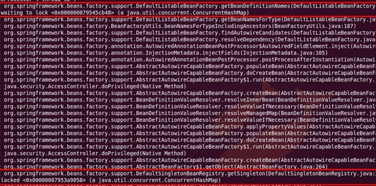

# Delay publish service

If your service need time to warm up.such as:initialization cache,or another reference resources has to be ready.so you can use the delay feature for delay publish service.

## Delay five second publish

```xml
<dubbo:service delay="5000" />
```

## Delay until Spring initialization is complete before exposing the service
```xml
<dubbo:service delay="-1" />
```

### The initialization deadlock problem of Spring 2.x

#### Trigger condition

The service has already published when `Spring` parse the `<dubbo:service />` element,but the `Spring` is still initializing other beans.If there is a request coming in, and the service implementation class has a call to `applicationContext.getBean ()` usage.

1. Request thread applicationContext.getBean () call, the first synchronization `singletonObjects` determine whether the existence of the bean, the synchronization does not exist to initialize the `beanDefinitionMap`, and re-synchronize `singletonObjects` write Bean instance cache.

      

2. But the `Spring` initialization thread,because need to determine the `Bean` is exist,Directly synchronize beanDefinitionMap to initialize, and synchronize singletonObjects write Bean instance cache.
      

This will cause the getBean thread to lock the singletonObjects first, then lock the beanDefinitionMap, and lock the singletonObjects again.The Spring initialization thread, the first lock beanDefinitionMap, then lock singletonObjects. Reverse lock thread deadlock, can not provide services, can not start.

#### Avoid ways

1. It is highly recommended not to call applicationContext.getBean () in the service implementation class, all using Spring's beans using IoC injection.
2. If you really want to tune getBean (), you can put the configuration of Dubbo Spring final loading.
3. If you do not want to rely on the configuration order, you can use `<dubbo: provider deplay =" - 1 "/>` to make Dubbo expose the service after the Spring container has been initialized.
4. If you use getBean () extensively, the equivalent of degenerating Spring to factory mode is to isolate Dubbo's service from a separate Spring container.

[^1]: Base on the  `ContextRefreshedEvent` event of the  Spring to trigger publish service.
